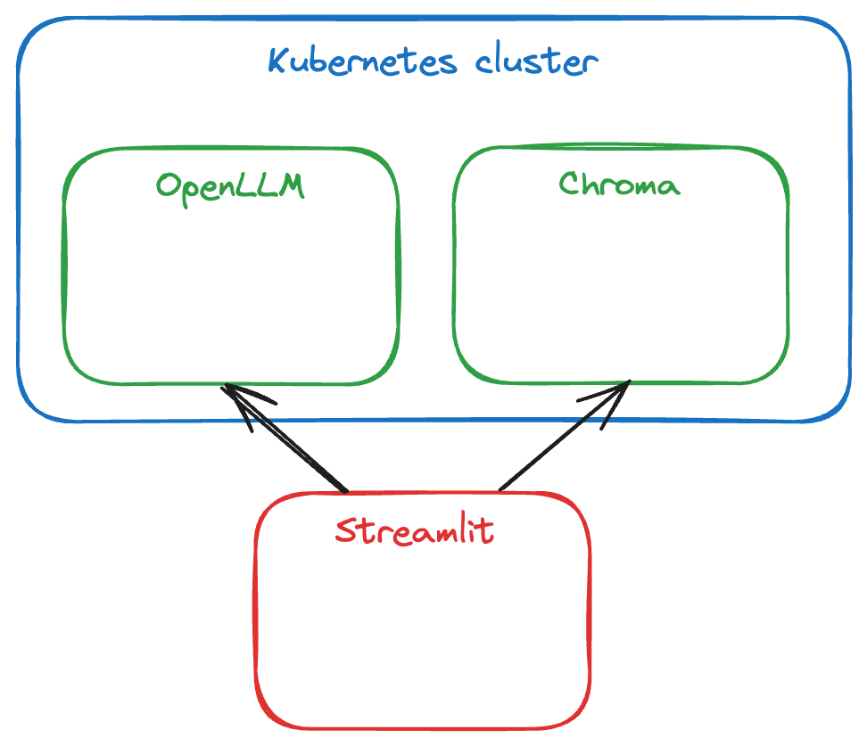

# Build GenAI application running locally for free

## Prerequisites

Before using code from that repository, please install tools:
- [Docker Desktop](https://docs.docker.com/desktop/) for running containers locally
- [kind](https://kind.sigs.k8s.io/) for running local Kubernetes

## Tech stack

In repository there were used multiple components:
- [OpenLLM](https://github.com/bentoml/OpenLLM) for open-source LLMs
- [Chroma](https://docs.trychroma.com/) as open-source vector database
- [LangChain](https://python.langchain.com/docs/introduction/) as a framework for developing application
- UI for powerful data application:
  - [Streamlit](https://docs.streamlit.io/)
  - [Gradio](https://www.gradio.app/)
  - [Dash](https://dash.plotly.com/)
  - [Panel](https://panel.holoviz.org/)
  - [Anvil](https://anvil.works/)



*Picture 1: Architecture diagram*

## Infrastructure

1. Create Kubernetes cluster using kind:
```bash
kind create cluster --config infra/k8s/multi-node.yaml --name home-lab
```
2. Build Docker images for OpenLLM and Chroma:
```bash
docker buildx build --tag openllm-service:latest --file infra/openllm/Dockerfile .
docker buildx build --tag chroma-service:latest --file infra/chroma/Dockerfile .
docker buildx build --tag load-balancer-k8s:latest --file infra/lb/Dockerfile .
```
3. Deploy OpenLLM and Chroma services in local Kubernetes cluster:
```bash
kind load docker-image openllm-service:latest --name home-lab
kind load docker-image chroma-service:latest --name home-lab

kubectl apply -f infra/openllm/k8s.yaml
kubectl apply -f infra/chroma/k8s.yaml
```
4. Clean environment if required:
```bash
kubectl delete -f infra/openllm/k8s.yaml
kubectl delete -f infra/chroma/k8s.yaml

kind delete cluster -n home-lab

docker image prune --all --force
docker system prune --all --force
```

## CI/CD

As all components for that repository are deployed locally, in CI/CD workflows there are prepared pipelines for:
- linting PR titles
- executing `pre-commit` tools for every PR
- doing release with CHANGELOG

For commands executed on local machines, there was prepared `Makefile`, using which in few steps you can deploy whole infrastructure.

## Application

Basic LLM app was built using tutorials:
- [Build a basic LLM chat app](https://docs.streamlit.io/develop/tutorials/llms/build-conversational-apps)
- [Build an LLM app using LangChain](https://docs.streamlit.io/develop/tutorials/llms/llm-quickstart)

1. Install dependencies:
```bash
cd app
python3 -m venv venv
source venv/bin/activate
pip install -r requirements.txt
```
2. Define OpenAI API key:
```bash
mkdir -p .streamlit
echo 'OPENAI_API_KEY = "YOUR_API_KEY"' > .streamlit/secrets.toml
```
3. Run Streamlit echo bot:
```bash
streamlit run echo_bot.py
```
4. Run Streamlit simple chat:
```bash
streamlit run simple_chat.py
```
5. Run Streamlit ChatGPT-like app and connect to OpenLLM running in local Kubernetes cluster:
```bash
streamlit run chat_gpt_like.py
```
6. Run Streamlit playground:
```bash
streamlit run playground.py
```
7. Run ChromaDB client and connect to Chroma DB running in local Kubernetes cluster:
```bash
python use_chromadb_client.py
```
